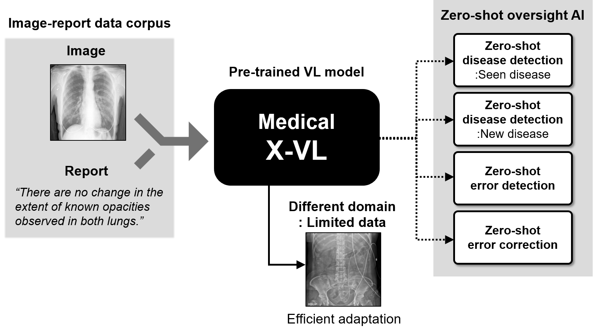

[](https://zenodo.org/badge/latestdoi/549019105)

## : Code for "Self-supervised Multi-modal Training from Uncurated Image and Reports Enables Zero-shot Oversight Artificial Intelligence in Radiology"
### Medical X-VL: Domain X-attention Vision-Language model
### Paper link: [https://arxiv.org/abs/2208.05140](https://arxiv.org/abs/2208.05140)

<div align="center">
  
</div>

### [Paper] | [Official Pytorch code](https://github.com/sangjoon-park/)


> **Medical X-VL: Medical Cross-attention Vision-Language model**<br>
>
> *Medical X-VL is a vision-language model developed to be tailored for the properties of the medical domain data. For demo, we provide python codes where you can vision-language model training, zero-shot oversight AI, visualize the cross-attention between the words and visual semantics.*

## System requirements
### General requirements
#### OS
* Ubuntu 20.04

#### Software
* Python 3.8 (tested on)
* Conda
* Pytorch 1.8.0 (tested on)
* CUDA version 11.3 (tested on)

#### Hardware
* CPU or GPU that supports CUDA CuDNN and Pytorch 1.8.
* We tested on GeFore RTX 3090.
* We recommend RAM of more than 32 GB.

## Installation guide
### Instruction
* Install Pytorch and other dependencies. It can be easily installed with requirements.txt file.
```
>  pip install -r requirements.txt
```

## Data preparation
### Downloading data

The open-source datasets used in paper can be obtained from following links.

#### Dataset preparation
* We follow the [MedViLL](https://github.com/SuperSupermoon/MedViLL) to preprocess and split the [MIMIC-CXR](https://physionet.org/content/mimic-cxr/2.0.0/) and [VQA-RAD](https://osf.io/89kps/) datasets. See this [link](https://github.com/SuperSupermoon/MedViLL) for details.
* COVID-19 and normal data can be downloaded in [Brixia](https://brixia.github.io/) and [NIH](https://cloud.google.com/healthcare-api/docs/resources/public-datasets/nih-chest) databases.

* The MIMIC-CXR database is available at [MIMIC](https://physionet.org/content/mimic-cxr/2.0.0/).
* Subset of the CheXpert test data and corresponding labels used for the evaluation of the model in zero-shot abnormality detection can be found at [CheXpert](https://github.com/rajpurkarlab/cheXpert-test-set-labels). 
* COVIDx dataset used for the evauation of the model in unseen disease is available at [COVIDx](https://www.kaggle.com/datasets/andyczhao/covidx-cxr2).


Other parts of the institutional data used in this study are not publicly available due to the patient privacy obligation. Interested users can request the access to these data for research, by contacting the corresponding author J.C.Y. (jong.ye@kaist.ac.kr).


## Download pretrained weights
You can download the pretrained weights in link below, which should be located as,

### VLP model for Chest radiographs

Coming soon.


### VLP model for abdominal radiographs

Coming soon.


## Training the model
### Vision-Language Pre-training
First, download the vision transformer (ViT-S/16) self-supervised on the MIMIC-CXR data from this [link](Comming Soon). We utilized this model as the uni-modal visual encoder.
```
>  --config ./configs/Pretrain.yaml --output_dir ./output/
```

### Zero-shot oversight AI to alert the clinically significant abnormalities
Coming soon.

### Zero-shot oversight AI to detect the critical radiology report errors
From the VLP weights, the model can be fine-tuned for the report generation task as below.
Coming soon

### Visualization
Succesful visualization will show the cross-attention between the words and the visual semantics (image patches) as below.
```
>  --config ./configs/Pretrain.yaml --output_dir ./output/ --checkpoint /PATH/TO/PRETRAIN/ --evaluate
```

<div align="center">
  
</div>


#### If you have any questions, please contact us via:
depecher@kaist.ac.kr
